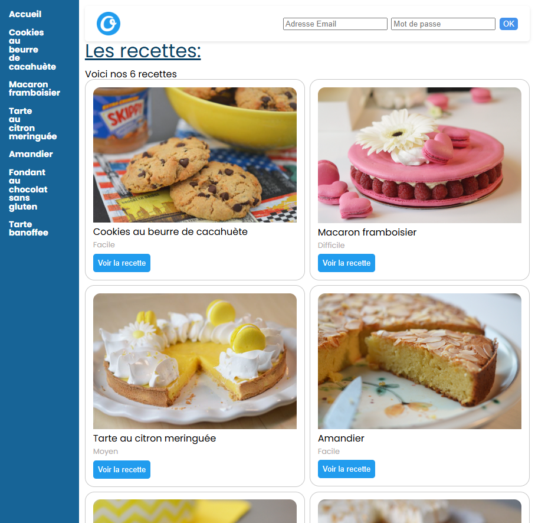
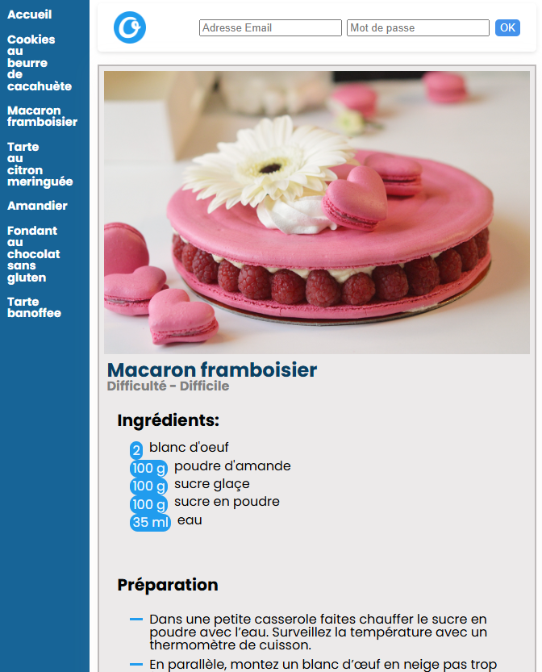

**Objectif** : réaliser une interface front en React qui affiche des recettes. 💪

## 1. Création du projet

- Créez un nouveau projet React avec Vite . J'utilise Biome à la place d'ESLint.

## 2. Structure statique de composants

**Objectif** : Créez la structure de la page d'acceuil en découpant avec les composants qui semblent pertinents.

Page d'accueil :

### Style 🎨

J'ai utilise CSS pour réaliser la page.

## 3. Recettes de l'API

**Objectif** : afficher les recettes de l'API.

Le code est l'API est dispo dans ce repo.

Pour la lancer en local, ouvrez le dossier `back_api/` dans un terminal et lancez les commandes `npm i` et `npm run start`. Le serveur tournera sur l'adresse : `http://localhost:3000/`.

- Mise en place un state qui permet d'accueillir la liste des recettes.
- Après le premier rendu de l'app, fetch des données et enregistrement dans les state.
- Utilisez les données du state pour créer les cartes recettes et les liens recettes du menu. Utilisation de .map 

## 4. Router et page recette

**Objectif** : au click sur un lien recette, afficher une page avec les détails de la recette (ingrédients et instructions)

page recette :

Il vous faut créer un routeur à l'aide de [react-router]

- Installation react-router
- Mettre en place le BrowserRouter
- Remplacer tous les liens par des Link ou NavLink
- Création des routes :
  - page d'acceuil avec toutes les cartes recettes
  - page recette avec les détails de la recette dont le slug sera dans l'URL (il faut créer une route dynamique, elle doit matcher quelque soit le slug)
- Création du composant pour cette page recette, dans ce composant pour récupérer le slug de l'URL il faut utiliser la fonction useParams de react-router-dom.

